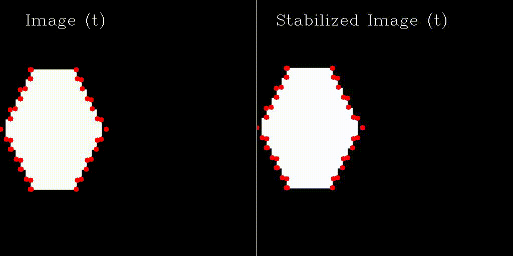

# lk-stabilization
Video Stabilization with Lukas Kanade optical flow from scratch (python)

     

    Stabilize the input video using homography
    1. Locate corners with Harris Detector
    2. Find matching feature points between the current frame and the reference frame using Lukas-Kanade
    3. Use RANSAC to filter outliers and compute the optimal affine transform
    4. Warp the current frame to the reference frame's coordinates
    5. Crop the edges and resize to aleviate border effects
    6. Occasionally update the reference frame and acquire new corners
